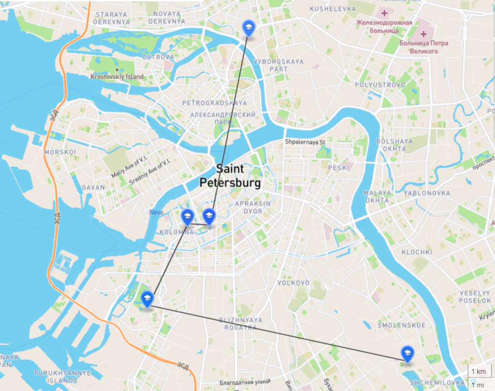

# Здания ВШЭ в Санкт-Петербурге
На карте отмечены 5 основных учебных зданий [НИУ ВШЭ в Санкт-Петербурге](https://spb.hse.ru/).

Линия отражает **оптимальный маршрут** для тех, кто хочет объехать все корпуса Вышки.

*Non scholae, sed vitae discimus*

